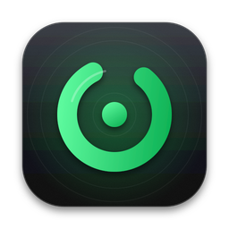
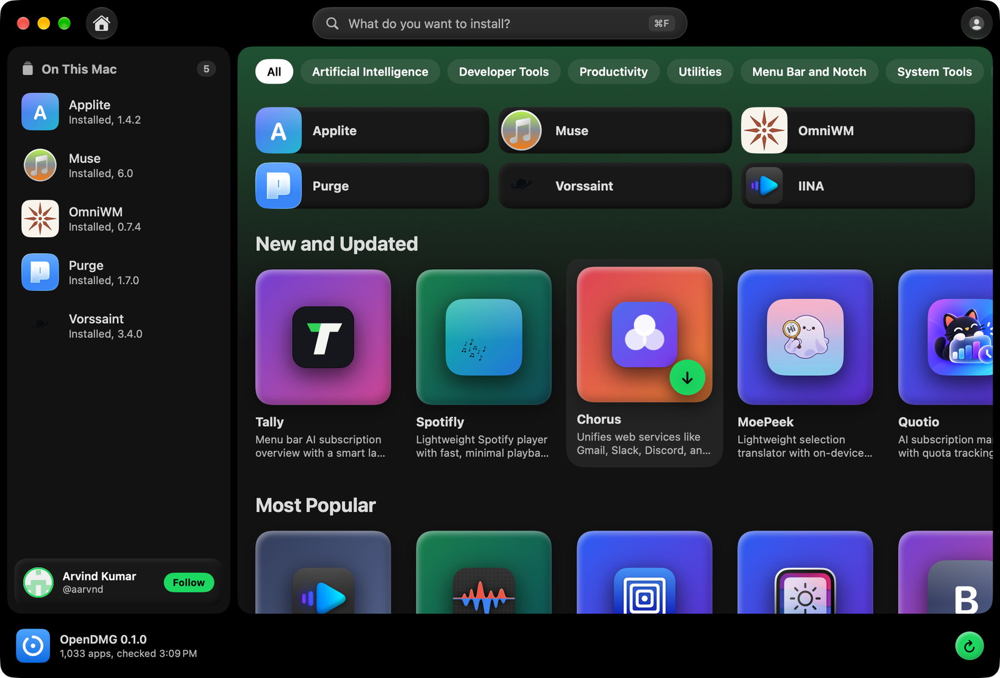
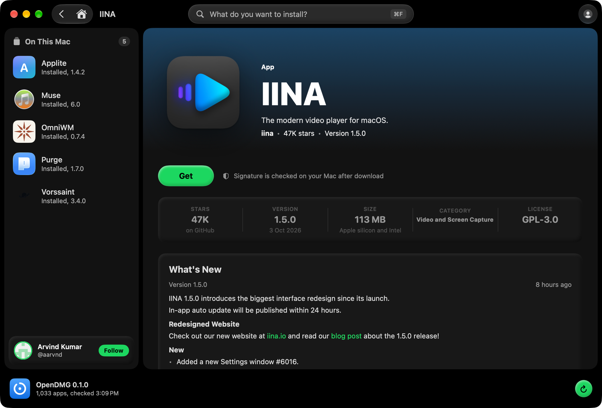
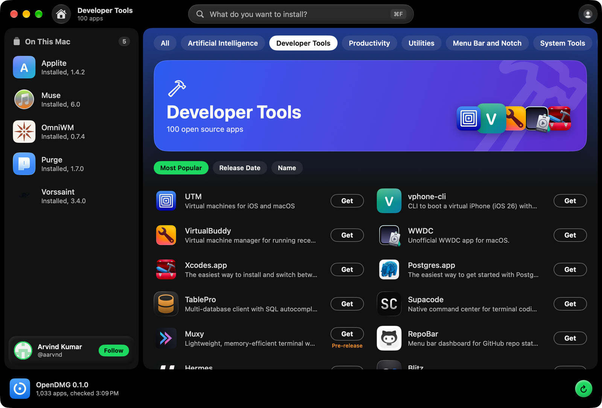

<p align="center">
  
</p>

<h1 align="center">OpenDMG</h1>

<p align="center">
  A free store for open source Mac apps.<br>
  Browse more than a thousand apps and install them with one click, straight from each developer's GitHub release.
</p>

<p align="center">
  <a href="https://github.com/aarvnd/OpenDMG/releases/latest/download/OpenDMG.dmg"><b>Download for Mac</b></a>
  &nbsp;·&nbsp;
  <a href="https://opendmg.app">opendmg.app</a>
  &nbsp;·&nbsp;
  <a href="https://github.com/aarvnd/OpenDMG/releases">All releases</a>
</p>

<p align="center">
  
</p>

## What it does

- **One click to install.** Press Get. OpenDMG downloads the app from its developer's GitHub release, checks it, and puts it in your Applications folder.
- **Checked before it runs.** Every download is compared with a SHA-256 fingerprint, its code signature is verified, and macOS Gatekeeper stays switched on.
- **Updates that respect you.** Apps you installed with OpenDMG update by themselves. An app that is open is never closed without asking.
- **Your apps in one place.** The "On This Mac" panel lists the catalog apps you already have, with their updates.
- **No account. Nothing tracked.** OpenDMG sends nothing about you to anyone.
- **Day and night.** The store follows your Mac's light and dark appearance.

<p align="center">
  
  
</p>

## Install

1. [Download OpenDMG.dmg](https://github.com/aarvnd/OpenDMG/releases/latest/download/OpenDMG.dmg).
2. Open it and drag OpenDMG into Applications.
3. Open OpenDMG.

OpenDMG is signed with a Developer ID and notarized by Apple, so it opens without a warning.

**Needs:** macOS 14 or newer, on Apple silicon or Intel.

## Verify your download

Each release lists the SHA-256 fingerprint of its files. To check yours:

```
shasum -a 256 ~/Downloads/OpenDMG.dmg
```

## Questions and problems

Open an [issue](https://github.com/aarvnd/OpenDMG/issues) and describe what happened and which version you use.

To suggest an app for the catalog, use the form on [opendmg.app](https://opendmg.app/#submit).

## About

OpenDMG is designed and built by **Arvind Kumar** ([@aarvnd](https://github.com/aarvnd), [arvind.codes](https://arvind.codes)).

This repository holds the releases of OpenDMG. The apps in the catalog belong to their own developers and are downloaded from their own GitHub releases.

<sub>The first version of the catalog was imported from the <a href="https://github.com/jaywcjlove/awesome-swift-macos-apps">awesome-swift-macos-apps</a> list by jaywcjlove (CC BY 4.0). OpenDMG is an independent project and is not affiliated with Apple.</sub>

© 2026 Arvind Kumar. All rights reserved.
